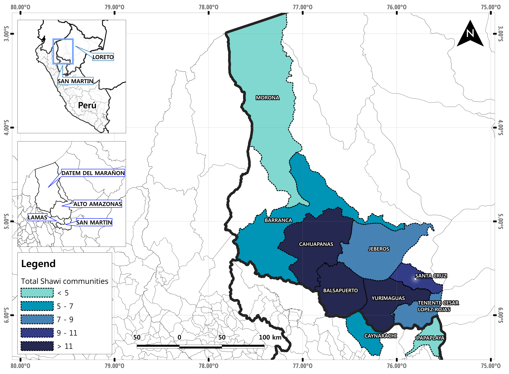
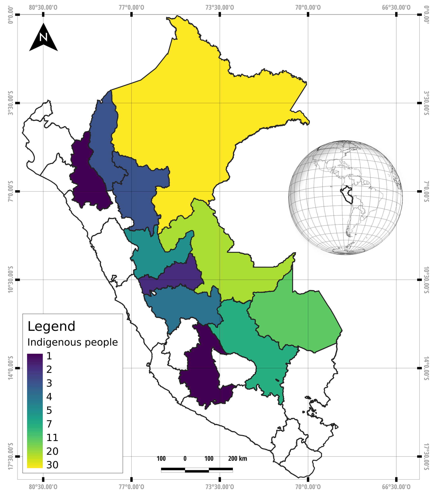

# __QShawi__
### __Features__

Software | Version |
-----|----------
QGIS | 3.20 Bonn

### __New colors ramp for QGIS__ 👇
```
https://raw.githubusercontent.com/ambarja/QShawi/main/colorsramp/ShawiColors.xml
```


### __Final maps__

Shawi communities ([download 🔽](https://github.com/ambarja/QShawi/raw/main/maps/Shawi_communities.zip))| Indigenous people ([download 🔽](https://github.com/ambarja/QShawi/raw/main/maps/Indigenous_people.zip))
---|---
|

### Download repository
- [download-QShawi 🔽](https://github.com/ambarja/QShawi/archive/refs/heads/main.zip)
